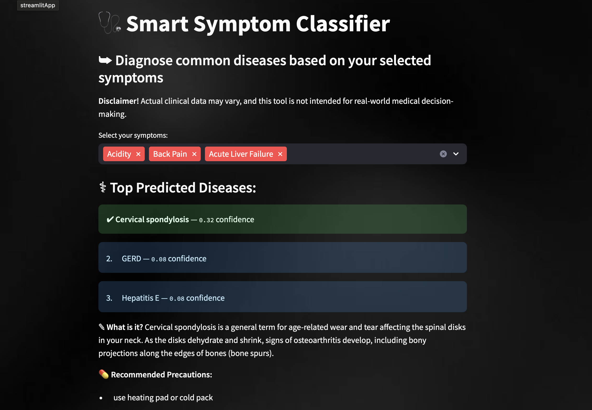

# Smart Symptom Classifier

An interactive machine learning app that predicts potential diseases based on selected symptoms using a trained Random Forest classifier. Built with Streamlit for real-time predictions and beautiful UI enhancements.

**Live App**: [Click here to try it!](https://smart-symptom-classifier-demo.streamlit.app/)  
**Dataset**: [Kaggle - Disease Symptom Dataset](https://www.kaggle.com/datasets/itachi9604/disease-symptom-description-dataset)

---

## Demo Preview

 <!-- Add a real screenshot! -->

---

## Features

- Multi-symptom disease prediction using Random Forest
- Medical descriptions + recommended precautions
- Clean UI with dropdowns
- Dashboard with word cloud + disease frequency charts
- “About & Notes” tab with model info + reflection

---

## Tech Stack

- **Python**  
- **Pandas**  
- **scikit-learn**  
- **Streamlit**  
- **WordCloud**  
- **matplotlib**

---

## What I Learned...

This project helped me explore:

- Binary symptom encoding for structured ML input  
- TF-IDF vs binary features in medical classification  
- Streamlit for clean app UI + real-time feedback  

---

## Disclaimer

> The data used in this project is for reference and educational purposes only.  
> It is synthetic and not sourced from real patients.  
> This tool is not intended for actual medical diagnosis.

---

## Next Steps

- Add patient demographic input (age, gender)
- Integrate `symptom-severity.csv` for weighting
- Explore deep learning (e.g. BERT for symptom descriptions)

---

## 🙋‍♀️ About Me

Built with ❤️ by Sarah Lamond
[LinkedIn](https://www.linkedin.com/in/sarahlamond/) | [GitHub](https://github.com/sarahlamond) | [Kaggle](https://www.kaggle.com/ctrlsari)

---

  

